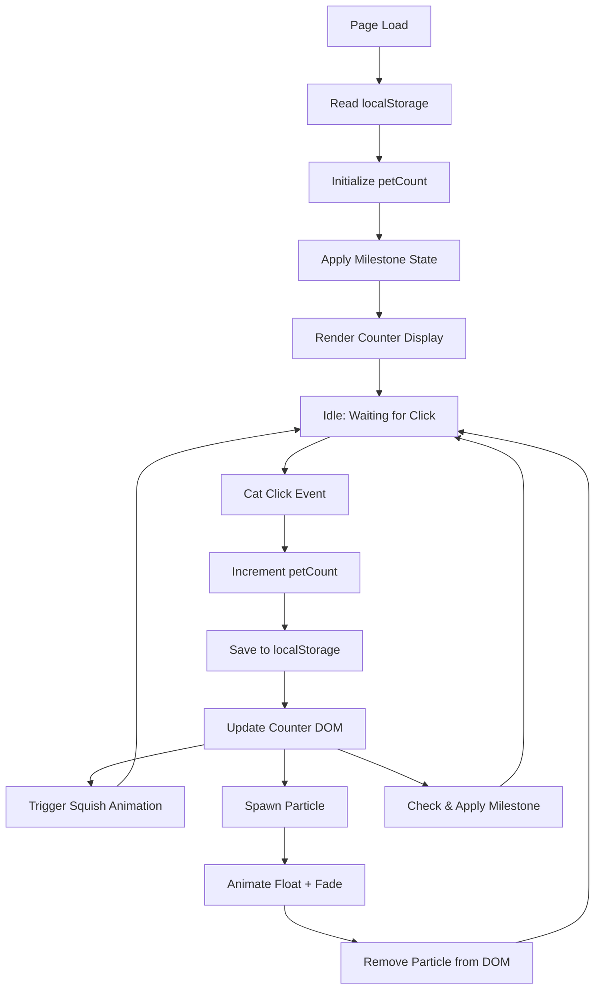

# Design Document: Cat Petting App

## Overview

The Cat Petting App is a self-contained, single-file web application (`index.html`) that delivers a lighthearted clicker experience. Users click a minimalist cat illustration to increment a pet counter, triggering animated reactions (squish animation, floating text particles) and progressive visual milestone changes. The pet count persists across sessions via `localStorage`.

**Tech stack:**
- HTML5 (semantic markup, inline SVG for the cat)
- Tailwind CSS loaded via CDN (utility-first styling, no build step)
- Vanilla JavaScript (ES6+, no frameworks or dependencies)

**Key design goal:** Everything lives in one file. No modules, no bundler, no server. Drop `index.html` anywhere and it works.

---

## Architecture

The application is a single-module vanilla JS program with a simple reactive loop:

```
User Click → Event Handler → State Mutation → DOM Update + Side Effects
```



**State is minimal and centralized:**
- `petCount` — single integer, the only mutable application state
- Milestone state is derived from `petCount` (no separate milestone variable)
- Particle elements are ephemeral DOM nodes (not stored in state)

---

## Components and Interfaces

The app is organized into logical sections within the single file, each as a JavaScript function or CSS block.

### 1. State Module (inline JS)

```js
// Single source of truth
let petCount = 0;
```

**Functions:**

| Function | Signature | Description |
|---|---|---|
| `loadCount()` | `() → number` | Reads and validates `localStorage`, returns integer ≥ 0 |
| `saveCount(n)` | `(number) → void` | Writes `n` to `localStorage` |
| `incrementAndSave()` | `() → void` | Increments `petCount`, saves, triggers all updates |

### 2. Counter Display

A `<div>` / `<p>` element showing "Pets Given: N".

**Functions:**

| Function | Signature | Description |
|---|---|---|
| `updateCounterDisplay()` | `() → void` | Sets `textContent` of the counter element to current `petCount` |

### 3. Cat Element

An inline SVG centered on the page, wrapped in a `<div id="cat">` click target.

- SVG draws a minimalist cat (head, ears, eyes, nose, whiskers, mouth)
- `cursor: pointer` applied via Tailwind `cursor-pointer` class
- Click listener attached to the wrapper `div`, not the SVG internals

### 4. Squish Animation

CSS keyframe animation applied via JS class toggle.

```css
@keyframes squish {
  0%   { transform: scale(1); }
  30%  { transform: scale(1.15, 0.85); }
  60%  { transform: scale(0.9, 1.1); }
  100% { transform: scale(1); }
}
.squish { animation: squish 300ms ease forwards; }
```

**Functions:**

| Function | Signature | Description |
|---|---|---|
| `triggerSquish()` | `() → void` | Adds `.squish` class; removes it after 300ms via `setTimeout` |

### 5. Particle System

Floating text elements spawned on click, animated, then removed.

**Particle text pool:** `["Meow!", "Purr...", "❤️", "✨"]`

**Functions:**

| Function | Signature | Description |
|---|---|---|
| `spawnParticle(x, y)` | `(number, number) → void` | Creates a `<span>` at `(x, y)`, picks random text, appends to body, starts animation |
| `animateParticle(el)` | `(HTMLElement) → void` | Uses CSS animation (float up + fade) for 1000ms, then removes element |

Particles use `position: fixed`, placed at the click coordinates, then animated via a CSS class.

```css
@keyframes floatFade {
  0%   { transform: translateY(0);   opacity: 1; }
  100% { transform: translateY(-80px); opacity: 0; }
}
.particle { animation: floatFade 1000ms ease forwards; }
```

### 6. Milestone System

Milestones are defined as a static array and applied by checking `petCount` against thresholds.

```js
const MILESTONES = [
  { threshold: 50,  class: "milestone-1" },
  { threshold: 100, class: "milestone-2" },
  { threshold: 200, class: "milestone-3" },
];
```

**Functions:**

| Function | Signature | Description |
|---|---|---|
| `applyMilestone(count)` | `(number) → void` | Removes all milestone classes from `<body>`, then adds the highest applicable class |

Milestone classes are applied to `<body>` and modify CSS custom properties or Tailwind overrides:

| Class | Visual Change |
|---|---|
| `milestone-1` (≥50) | Background shifts from lavender to warm peach |
| `milestone-2` (≥100) | Background shifts to soft mint; cat gets a happy glow |
| `milestone-3` (≥200) | Background becomes golden; cat gains a sparkle/crown accent |

### 7. LocalStorage Layer

```js
const STORAGE_KEY = "cat_pet_count";

function loadCount() {
  const raw = localStorage.getItem(STORAGE_KEY);
  const parsed = parseInt(raw, 10);
  return Number.isFinite(parsed) && parsed >= 0 ? parsed : 0;
}

function saveCount(n) {
  localStorage.setItem(STORAGE_KEY, String(n));
}
```

Validation ensures corrupted or missing values fall back safely to `0`.

---

## Data Models

### Application State

```
petCount: number   // Non-negative integer, persisted to localStorage
```

That's the entire mutable state. Everything else is either derived (milestone level from `petCount`) or ephemeral (particle DOM nodes).

### LocalStorage Schema

| Key | Type | Description |
|---|---|---|
| `"cat_pet_count"` | string (numeric) | Stringified non-negative integer |

**Validation rules on read:**
1. `localStorage.getItem("cat_pet_count")` — if `null`, return `0`
2. `parseInt(value, 10)` — if `NaN` or negative, return `0`
3. Otherwise return parsed integer

### Milestone Derived State

```
milestoneLevel: 0 | 1 | 2 | 3   // derived: highest threshold ≤ petCount
```

| petCount range | milestoneLevel | CSS class on `<body>` |
|---|---|---|
| 0–49 | 0 | (none) |
| 50–99 | 1 | `milestone-1` |
| 100–199 | 2 | `milestone-2` |
| 200+ | 3 | `milestone-3` |

### Particle (Ephemeral)

Not stored in state. Each particle is a transient DOM element:

```
{
  element: HTMLSpanElement,  // positioned fixed, class="particle"
  text: "Meow!" | "Purr..." | "❤️" | "✨",
  x: number,  // click clientX
  y: number   // click clientY
}
```

Lifetime: spawned on click → CSS animation runs 1000ms → `animationend` event removes element from DOM.


---

## Correctness Properties

*A property is a formal statement about what the system should do, holding true across all valid executions. Properties serve as the bridge between human-readable specifications and machine-verifiable correctness guarantees.*

### Property 1: Click increments counter by exactly one

For any non-negative integer value of `petCount`, calling `incrementAndSave()` must produce a new `petCount` equal to the original value plus exactly 1.

**Validates: Requirements 1.2**

### Property 2: Counter display always reflects current state

For any non-negative integer assigned to `petCount`, calling `updateCounterDisplay()` must result in the counter DOM element's text content containing that exact numeric value.

**Validates: Requirements 1.3**

### Property 3: localStorage round-trip preserves pet count

For any valid non-negative integer `n`, calling `saveCount(n)` then `loadCount()` must return the same value `n`. Additionally, a value stored in localStorage before page load must be restored as `petCount` on initialization.

**Validates: Requirements 1.4, 6.1, 6.2**

### Property 4: Invalid localStorage values fall back to zero

For any value stored under `cat_pet_count` that is not a valid non-negative integer (including `null`, `NaN`, negative numbers, non-numeric strings, empty strings), `loadCount()` must return exactly `0`.

**Validates: Requirements 1.5, 6.3**

### Property 5: Milestone class applied correctly for all counts

For any non-negative integer `petCount`, calling `applyMilestone(petCount)` must result in `<body>` having exactly one milestone class (or none) per the highest applicable threshold. No two milestone classes may coexist simultaneously.

| petCount range | Expected state |
|---|---|
| 0–49 | no milestone class |
| 50–99 | only `milestone-1` |
| 100–199 | only `milestone-2` |
| 200+ | only `milestone-3` |

**Validates: Requirements 5.1, 5.2, 5.3, 5.4**

### Property 6: Particle text is always from the allowed set

For any call to `spawnParticle(x, y)`, the spawned particle's `textContent` must be a member of `["Meow!", "Purr...", "❤️", "✨"]`.

**Validates: Requirements 4.2**

### Property 7: Particle position reflects click coordinates

For any `(x, y)` coordinates passed to `spawnParticle(x, y)`, the spawned element's `style.left` and `style.top` must be within 20px of those coordinates.

**Validates: Requirements 4.1**

### Property 8: Particle is removed from DOM after animationend

For any particle spawned by `spawnParticle()`, once `animationend` fires on that element, `document.body.contains(particle)` must return `false`. No orphaned particle elements should accumulate.

**Validates: Requirements 4.4**

---

## Error Handling

The app is a pure client-side single-file application with no network requests, so the error surface is narrow.

### localStorage Errors

**Corrupted or missing data:**
`loadCount()` validates the read value: `parseInt(raw, 10)` → check `isFinite` and `>= 0` → fall back to `0` if any condition fails. Covers: `null`, `""`, `"abc"`, `"-5"`, `"NaN"`.

**localStorage unavailable (e.g., private browsing with storage blocked):**
`localStorage.getItem` and `localStorage.setItem` may throw `SecurityError` in some browsers. Both `loadCount` and `saveCount` are wrapped in `try/catch`; on failure, the app silently continues with in-memory state — the counter still works, it just won't persist.

```js
function saveCount(n) {
  try {
    localStorage.setItem(STORAGE_KEY, String(n));
  } catch (e) {
    // Storage unavailable; continue without persistence
  }
}

function loadCount() {
  try {
    const raw = localStorage.getItem(STORAGE_KEY);
    const parsed = parseInt(raw, 10);
    return Number.isFinite(parsed) && parsed >= 0 ? parsed : 0;
  } catch (e) {
    return 0;
  }
}
```

### Animation / DOM Errors

**Squish class not removed:** `triggerSquish()` uses `setTimeout(300)` to remove `.squish`. If the element is removed before the timeout fires, the callback is a no-op — `classList.remove` on a detached element is harmless.

**Particle cleanup:** Particles are removed via `animationend`. Calling `el.remove()` on an already-removed element is idempotent and throws no error. If `animationend` never fires (e.g., `animation: none` via user stylesheet), the particle stays visible but does not break app functionality.

### Integer Overflow

JavaScript `Number` is a 64-bit float, safe for integers up to 2^53 − 1 (~9 quadrillion). No overflow guard is needed for a clicker app.

### Milestone Edge Cases

`applyMilestone` always removes all milestone classes before adding the new one, preventing class accumulation on repeated calls or on localStorage restore at an arbitrary value.

---

## Testing Strategy

### Approach

Since this is a no-build, single-file vanilla JS app, the testing strategy uses lightweight tools requiring zero configuration.

**Recommended tooling:**
- **Property-based tests:** [fast-check](https://fast-check.io/) + [Vitest](https://vitest.dev/)
- **DOM tests:** [jsdom](https://github.com/jsdom/jsdom) (via Vitest's jsdom environment)
- **Manual / visual tests:** browser + DevTools for layout, animation, and responsive design

The pure logic functions (`loadCount`, `saveCount`, `applyMilestone`, `updateCounterDisplay`, `incrementAndSave`, `spawnParticle`) are isolated as testable units with mockable `localStorage` and DOM via jsdom.

### Unit Tests (Example-Based)

| Test | Target | What is verified |
|---|---|---|
| Initial display | `updateCounterDisplay` | DOM shows "Pets Given: 0" on fresh load |
| SVG presence | DOM structure | Cat SVG element exists and is centered |
| Cursor style | Cat element | `cursor-pointer` class is present |
| Squish class added | `triggerSquish` | `.squish` added immediately on call |
| Squish class removed | `triggerSquish` | `.squish` absent after 300ms (fake timers) |
| Particle CSS class | `spawnParticle` | `.particle` class applied to spawned element |
| localStorage unavailable | `saveCount` / `loadCount` | App degrades gracefully, no unhandled exception |

### Property-Based Tests

Each property test runs a minimum of **100 iterations** with randomly generated inputs via fast-check. Each test references the property number from this document.

**Tag format:** `// Feature: cat-petting-app, Property {N}: {description}`

```js
// Property 1: Click increments counter by exactly one
fc.assert(fc.property(fc.integer({ min: 0, max: 1_000_000 }), (startCount) => {
  petCount = startCount;
  incrementAndSave();
  return petCount === startCount + 1;
}), { numRuns: 100 });

// Property 3: localStorage round-trip preserves pet count
fc.assert(fc.property(fc.integer({ min: 0, max: 1_000_000 }), (n) => {
  saveCount(n);
  return loadCount() === n;
}), { numRuns: 100 });

// Property 5: Milestone class applied correctly for all counts
fc.assert(fc.property(fc.integer({ min: 0, max: 500 }), (count) => {
  applyMilestone(count);
  const cls = document.body.classList;
  const active = ["milestone-1","milestone-2","milestone-3"].filter(c => cls.contains(c));
  if (count < 50)  return active.length === 0;
  if (count < 100) return active.length === 1 && cls.contains("milestone-1");
  if (count < 200) return active.length === 1 && cls.contains("milestone-2");
  return active.length === 1 && cls.contains("milestone-3");
}), { numRuns: 100 });
```

### Visual / Manual Tests

- App renders correctly at 320px (mobile) and 1920px (desktop) viewports
- Background is soft pastel lavender on initial load
- Background shifts correctly at each milestone (50 → peach, 100 → mint, 200 → golden)
- Squish animation looks snappy (~60fps, no jank)
- Particles rise and fade smoothly within 1000ms
- `index.html` opens directly in a browser with no server — Tailwind CDN loads correctly
